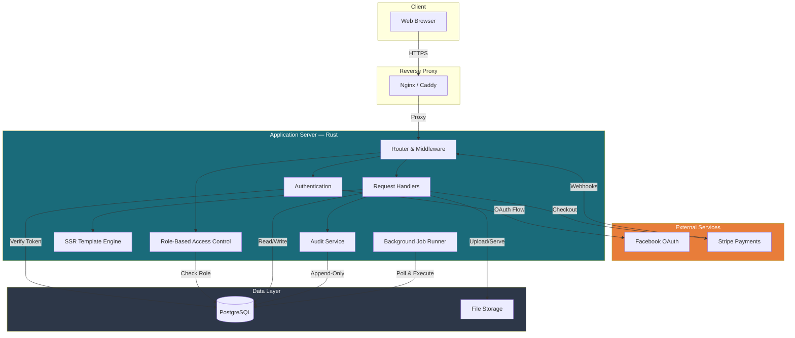

# System Architecture

## System Diagram

## Component Overview

### Router & Middleware
All HTTP requests pass through a middleware stack that handles CORS enforcement, request ID generation, and authentication extraction. Routes are grouped by access level: public, authenticated, and admin. Each group applies its own middleware layer.

### Authentication
Two authentication paths converge into a single JWT-based session:

1. **Facebook OAuth** — Primary flow for the existing community. Redirects to Facebook, exchanges the authorization code for an access token, fetches the profile, and creates or updates the local user record.
2. **Email/Password** — Fallback for members without Facebook. Passwords are hashed with Argon2 before storage.

Both paths issue a signed JWT stored in an HTTP-only cookie. Tokens expire after 24 hours. Sessions are tracked in the database for revocation support.

### Role-Based Access Control
Authorization uses a four-tier tenant role model:

| Role | Capabilities |
|------|-------------|
| **Owner** | Full platform control, member management, role assignment |
| **Admin** | Content moderation, event management, member trust configuration |
| **Member** | Create listings, RSVP to events, send messages |
| **Guest** | Browse public content |

Every data query is scoped to the tenant. Ownership verification prevents members from modifying resources they don't own.

### Request Handlers
Handlers implement the business logic for each route. They validate input, enforce authorization, interact with the database, and return either JSON (API routes) or rendered HTML (page routes). Handlers are organized by domain: auth, listings, events, conversations, notifications, and admin operations.

### SSR Template Engine
Pages are rendered server-side using a compile-time template engine. Templates produce complete HTML documents — no client-side JavaScript framework is required for core functionality. This eliminates entire classes of XSS vulnerabilities and ensures fast first paint on any device.

### Audit Service
A centralized service that logs every significant action to an immutable audit table. The audit log captures the actor, action, affected entity, field-level change diffs, sensitivity classification, and request metadata. Database rules enforce append-only behavior — no updates or deletes are possible on audit records.

### Background Job Runner
An in-process job runner polls the background jobs table for pending work. Jobs include:
- **Listing expiry** — Checks for listings past their 30-day window and marks them expired
- **Notification dispatch** — Sends queued notifications through configured channels
- **Series generation** — Creates future instances of recurring event series
- **Cleanup** — Removes expired holds and revoked sessions

Jobs support configurable retry limits with structured error tracking.

## Technology Justification

### Why Rust
- **Compile-time safety** eliminates null pointer exceptions, data races, and buffer overflows
- **Compile-time verified SQL** catches query errors at build time, not at runtime
- **Performance** — Sub-millisecond response times for most routes without caching
- **Single binary deployment** — No runtime dependencies, no garbage collector pauses
- **Shared domain primitives** — Reusable type library shared across multiple projects

### Why Server-Side Rendering
- **Security** — No exposed API surface for SPA clients to abuse. Template rendering happens on the server.
- **Performance** — Complete HTML on first request. No loading spinners, no hydration delay.
- **SEO** — Search engines receive fully rendered pages without JavaScript execution.
- **Simplicity** — No client-side state management, no build pipeline for a JavaScript bundle.

### Why PostgreSQL
- **JSONB columns** with GIN indexes enable flexible, type-specific metadata on listings without schema proliferation
- **Full-text search** via `tsvector` / `tsquery` avoids the need for a separate search engine
- **Row-level locking** (`SELECT FOR UPDATE`) prevents race conditions in capacity management
- **Partial unique indexes** enforce business rules like "one active owner per tenant" at the database level
- **Immutable audit** via PostgreSQL rules (`DO INSTEAD NOTHING`) guarantees append-only behavior without application-layer enforcement

## Architectural Principles

### Tenant-Scoped Data
Every query filters by tenant ID. There is no cross-tenant data access. The schema is designed for single-tenant operation today with the structural foundation for multi-tenant expansion.

### Soft Deletes
Records are never physically deleted. A `deleted_at` timestamp marks removal, and all queries filter on `WHERE deleted_at IS NULL`. This supports audit compliance, accidental deletion recovery, and GDPR-style data lifecycle management.

### Immutable Audit Trail
The audit log is append-only by database rule. Every moderation action, role change, login attempt, and content modification is permanently recorded with actor identity, timestamp, and field-level diffs.

### Polymorphic Encounters
Adventures are modeled using a generic encounter pattern. An encounter can represent a hiking trip, a kayak expedition, a social gathering, or any other activity type. The encounter tracks lifecycle state (scheduled → active → completed) while the calendar event provides the public-facing schedule. This pattern supports 14 adventure types without type-specific tables.

### Capacity as a First-Class Concept
Event capacity is managed through dedicated capacity pools with a hold-then-reserve pattern. Temporary holds expire automatically, preventing indefinite seat hoarding. Row-level database locking ensures that concurrent RSVPs cannot oversell an event.
