# GAF Brand Guide

This document describes the visual identity system designed for the Gay Adventure Friends platform. Every color, font choice, and design element is intentional — derived from your community's actual adventure photography.

---

## Logo

<p align="center">
  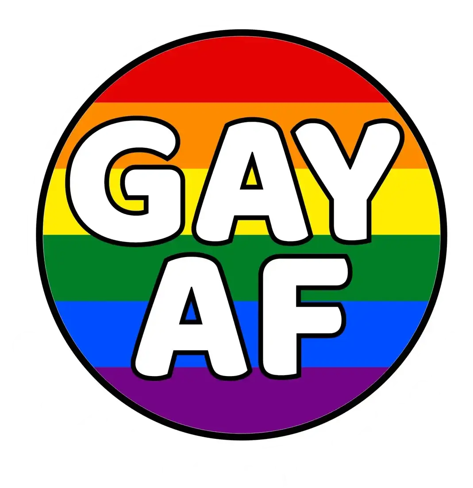
</p>

The GAF logo is the rainbow pride circle with bold white "GAY AF" text and black outlines. The six-stripe pride flag (red, orange, yellow, green, blue, purple) fills the circle. It's playful, bold, and immediately communicates the community's identity.

**Where it appears:**
- Navigation header (compact, approximately 40px)
- Home page hero section (larger, approximately 120px)
- Browser tab icon (favicon, cropped circle)

---

## Color Palette

Every color in the palette was pulled from real GAF adventure photos. The site feels like it belongs to this community because it literally comes from your photography.

### Full Palette at a Glance

| | Dark | Base | Light | Family |
|---|---|---|---|---|
| **Ocean Teal** | 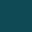 `#0f4a55` | 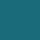 `#1a6b7a` | 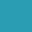 `#2a9db3` | Primary |
| **Sunset Warm** | 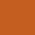 `#c45e20` | 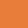 `#e87d3a` | 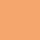 `#f4a66c` | Secondary |
| **Golden Hour** | 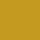 `#c49a20` |  `#e8c040` | 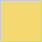 `#f5d870` | Accent |
| **Sandstone** | 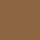 `#8a6540` | 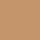 `#c4956a` | 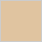 `#e0c4a0` | Earth |
| **SoCal Blue** | 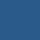 `#2a5a8a` |  `#4a88c8` | 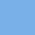 `#7ab0e8` | Sky |
| **Sage Green** | 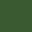 `#3a5a32` |  `#5a7a50` | 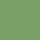 `#7aa068` | Trail |
| **Neutrals** | 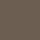 `#6b5e50` | 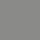 `#8a8a88` | 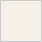 `#f5f0e8` | Text / BG |

### Primary — Ocean Teal

From the water in your kayaking, whale watching, sailing, and snorkeling photos.

| Swatch | Hex | Name | Usage |
|--------|-----|------|-------|
|  | `#0f4a55` | Night Ocean (dark) | Nav/footer background |
|  | `#1a6b7a` | Deep Ocean Teal (base) | Primary buttons, links |
|  | `#2a9db3` | Shallow Water (light) | Hover states, accents |

This is the dominant color. It's used for the navigation bar, footer, buttons, and links. It says "ocean" and "adventure" without saying it.

### Secondary — Sunset Warm

From the Sunset Cliffs golden hour shots and desert sunset photography.

| Swatch | Hex | Name | Usage |
|--------|-----|------|-------|
|  | `#c45e20` | Deep Sunset (dark) | Button hover |
|  | `#e87d3a` | Sunset Orange (base) | CTA buttons (Join, RSVP) |
|  | `#f4a66c` | Peach Glow (light) | Alerts, soft highlights |

Used for call-to-action buttons ("Join," "RSVP"), alerts, and highlights. It draws the eye and creates energy — the warm counterpart to the cool teal.

### Accent — Golden Hour

From sunset reflections on water, life vests, and sandstone highlights.

| Swatch | Hex | Name | Usage |
|--------|-----|------|-------|
|  | `#c49a20` | Deep Gold (dark) | Active states |
|  | `#e8c040` | Golden Amber (base) | Nav hover, underlines |
|  | `#f5d870` | Light Gold (light) | Subtle highlights |

Used for hover effects on navigation links, underlines, and subtle highlights. It complements the rainbow logo without competing with it.

### Earth — Sandstone

From Bryce Canyon hoodoos, coastal cliffs, and trail dirt.

| Swatch | Hex | Name | Usage |
|--------|-----|------|-------|
|  | `#8a6540` | Deep Earth (dark) | Dark borders |
|  | `#c4956a` | Warm Sandstone (base) | Borders, dividers |
|  | `#e0c4a0` | Buff Sand (light) | Secondary backgrounds |

Used for borders, dividers, and secondary backgrounds. Grounds the design in the desert and canyon landscapes your group explores.

### Sky — SoCal Blue

From the clear blue skies that appear in nearly every GAF photo.

| Swatch | Hex | Name | Usage |
|--------|-----|------|-------|
|  | `#2a5a8a` | Deep Sky (dark) | Dark info states |
|  | `#4a88c8` | SoCal Blue (base) | Info badges, calendar |
|  | `#7ab0e8` | Bright Sky (light) | Light info highlights |

Used for informational badges, links in content areas, and calendar elements. Familiar and calming — the backdrop to every adventure.

### Trail — Sage Green

From hiking foliage, Yosemite pines, and coastal vegetation.

| Swatch | Hex | Name | Usage |
|--------|-----|------|-------|
|  | `#3a5a32` | Forest (dark) | Dark success states |
|  | `#5a7a50` | Sage Green (base) | Success badges |
|  | `#7aa068` | Meadow (light) | Light success highlights |

Used for success states (approved listings, confirmed RSVPs, completed events). Evokes the trails and natural settings of your adventures.

### Neutrals

| Swatch | Hex | Name | Usage |
|--------|-----|------|-------|
|  | `#6b5e50` | Driftwood | Body text, headings |
|  | `#8a8a88` | Granite | Muted text, captions |
|  | `#f5f0e8` | Beach Sand | Page backgrounds |
|  | `#ffffff` | White | Card backgrounds |

Beach Sand (`#f5f0e8`) replaces the cold gray backgrounds used on most websites. It's warmer, friendlier, and feels like being outside. White is used for content cards that float over the background photography.

---

## How the Logo and Palette Work Together

The rainbow logo is bold and self-contained — six bright pride flag colors in a circle. The site palette deliberately avoids those same bright reds, oranges, yellows, greens, blues, and purples at full saturation. Instead, the site uses muted, nature-derived versions of similar tones. The result: the logo pops against the site, and the site feels cohesive without clashing.

---

## Typography

The platform uses a clean, modern type system that's readable on any device — from a phone on a trailhead to a desktop at home.

### Font Family

**System sans-serif stack** — no custom font downloads, which means instant loading on any device and any connection speed.

```
Font Stack: -apple-system, BlinkMacSystemFont, "Segoe UI", Roboto,
            "Helvetica Neue", Arial, sans-serif
```

This renders as San Francisco on iPhones/Macs, Segoe UI on Windows, and Roboto on Android — each device's native, most readable font.

### Type Scale

| Element | Size | Weight | Color | Notes |
|---------|------|--------|-------|-------|
| **Page Title (H1)** | 36px (2.25rem) | 800 Extra Bold |  Driftwood | Tight letter spacing (-0.025em) |
| **Section Title (H2)** | 30px (1.875rem) | 700 Bold |  Driftwood | Tight letter spacing (-0.025em) |
| **Subsection (H3)** | 24px (1.5rem) | 600 Semibold |  Ocean Teal | Adds color contrast at this level |
| **Card Title (H4)** | 20px (1.25rem) | 600 Semibold |  Driftwood | |
| **Body Text** | 16px (1rem) | 400 Regular |  Driftwood | Line height 1.625 (relaxed) |
| **Small / Captions** | 14px (0.875rem) | 400 Regular |  Granite | |
| **Badges / Labels** | 12px (0.75rem) | 600 Semibold | Varies | Uppercase, letter spacing 0.05em |

### Navigation Text

| Property | Value |
|----------|-------|
| Size | 14px (0.875rem) |
| Weight | 500 (medium) |
| Transform | Uppercase |
| Letter spacing | 0.5px |
| Color |  White |
| Hover color |  Golden Amber (`#e8c040`) |
| Hover underline |  Golden, grows on hover |

---

## The Frosted Glass Design

This is the signature visual element of the GAF site. Content cards appear to float over full-screen adventure photography, with a soft frosted-glass blur effect. It makes the site feel like looking through a window at your adventures.

### How It Works

```
┌─────────────────────────────────────────────────────┐
│                                                     │
│   Full-screen adventure photo (fixed background)    │
│                                                     │
│      ┌─────────────────────────────────────┐        │
│      │░░░░░░░░░░░░░░░░░░░░░░░░░░░░░░░░░░░│        │
│      │░░  Frosted glass content card     ░░│        │
│      │░░                                 ░░│        │
│      │░░  Text, buttons, and content     ░░│        │
│      │░░  appear here — readable but     ░░│        │
│      │░░  the photo shows through        ░░│        │
│      │░░                                 ░░│        │
│      │░░░░░░░░░░░░░░░░░░░░░░░░░░░░░░░░░░░│        │
│      └─────────────────────────────────────┘        │
│                                                     │
│   Photo continues behind and around the card        │
│                                                     │
└─────────────────────────────────────────────────────┘
```

### Glass Card Properties

| Property | Value | What It Does |
|----------|-------|-------------|
| Background | white at 88% opacity | Mostly opaque so text is readable, but the photo peeks through |
| Blur | 10px backdrop blur | Softens the photo behind the card like frosted glass |
| Border | white at 50% opacity | Subtle edge that catches light |
| Shadow | soft 32px spread | Lifts the card off the background |
| Corner radius | 12px | Rounded corners feel friendly and modern |
| Padding | 24px | Comfortable breathing room around content |

### Navigation Bar

| Property | Value |
|----------|-------|
| Background | deep teal at 80% opacity (`#0f4a55` at 0.80) |
| Text | white |
| Hover | golden amber (`#e8c040`) with growing underline |

### Footer

| Property | Value |
|----------|-------|
| Background | deep teal at 85% opacity (`#0f4a55` at 0.85) |
| Text | white |
| Links | golden amber (`#e8c040`) |

---

## Background Photography

The background images rotate randomly on each page load. All images are real photos from GAF adventures, converted to optimized WebP format for fast loading.

| Photo | Location | Scene |
|-------|----------|-------|
| Whale Watching | La Paz, Mexico | Group on boat watching whales |
| Sunset Cliffs | San Diego | Group at golden hour on the cliffs |
| Bryce Canyon | Utah | Hoodoo landscape |
| Channel Islands Kayak | Santa Cruz Island | Kayaking in sea caves |
| Yosemite | Glacier Point | Group with Half Dome |
| Los Penasquitos | San Diego | Waterfall hike |
| Sailing | San Diego Bay | Group on sailboat |
| Whale Petting | La Paz, Mexico | Touching a gray whale |
| Snorkeling | La Jolla Shores | Group snorkeling |

### Photographer Credit

When a visitor scrolls past the footer, the page reveals the full background photo with the photographer's name and location overlaid. This gives credit to community members who took the photos and creates a satisfying scroll-to-reveal moment.

---

## Buttons

| Button | Color | Hover | Text | Example Use |
|--------|-------|-------|------|-------------|
| **Primary** |  `#1a6b7a` Ocean Teal |  `#0f4a55` | White | "Join the Community", "Save", "Send" |
| **Secondary** | White with  `#c4956a` border |  `#f5f0e8` |  `#6b5e50` | "Learn More", "Cancel", "Back" |
| **Call to Action** |  `#e87d3a` Sunset Orange |  `#c45e20` | White | "RSVP", "Join This Adventure", "Donate" |
| **Success** | 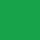 `#16a34a` Green | 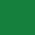 `#15803d` | White | "Approve" |
| **Danger** |  `#dc2626` Red |  `#b91c1c` | White | "Reject", "Remove", "Delete" |

All buttons use 6px corner radius, 14px font at weight 500, and 12px vertical / 24px horizontal padding. Call-to-action buttons are slightly larger at 16px font, weight 600.

---

## Status Badges

These small colored labels appear throughout the site to indicate the state of things:

| Badge | Background | Text | Where It Appears |
|-------|-----------|------|-----------------|
| **Approved** | 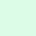 `#dcfce7` |  `#166534` | Approved listings, confirmed RSVPs |
| **Pending** | 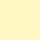 `#fef9c3` | 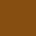 `#854d0e` | Listings awaiting review |
| **Rejected** |  `#fee2e2` |  `#991b1b` | Rejected listings, cancelled events |
| **Featured** |  `#dbeafe` |  `#1e40af` | Promoted listings |
| **Admin** | 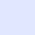 `#e0e7ff` | 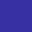 `#3730a3` | Admin dashboard badge |

---

## Spacing & Layout

| Element | Value | Purpose |
|---------|-------|---------|
| Page max width | 1152px (72rem) | Content doesn't stretch too wide on big monitors |
| Page padding | 16px on mobile, 24px on desktop | Breathing room on the sides |
| Content padding | 32px top/bottom | Space between nav and content |
| Card padding | 24px | Space inside glass cards |
| Card gap | 16px | Space between cards in a grid |
| Card corner radius | 12px | Rounded, friendly feel |
| Section spacing | 48px between major sections | Clear visual separation |

---

## Summary

The GAF brand identity is built on three pillars:

1. **Your own photography** — the background images and color palette come directly from real GAF adventures, so the site feels authentically yours
2. **Frosted glass** — content floats over adventure photos, creating a modern, premium feel that's unlike any other community site
3. **Warm, not corporate** — beach sand backgrounds, rounded corners, driftwood text, and nature-derived colors make the site feel welcoming, not sterile

Every pixel ties back to the community and the adventures you share.
