# Database Design

The GAF platform uses PostgreSQL with 24 tables organized across 10 domains. The schema is designed around shared domain primitives — reusable models for identity, authorization, communication, scheduling, and capacity management.

## Entity-Relationship Diagram

```mermaid
erDiagram
    %% ─── AUTH DOMAIN ───
    users {
        uuid id PK
        varchar email UK
        varchar password_hash
        varchar status
        uuid person_id FK
        timestamp last_login_at
        varchar facebook_id UK
        timestamp created_at
        timestamp updated_at
        timestamp deleted_at
    }

    sessions {
        uuid id PK
        uuid user_id FK
        varchar token
        timestamp expires_at
        timestamp revoked_at
        varchar ip_address
        text user_agent
        timestamp created_at
    }

    login_attempts {
        uuid id PK
        varchar email
        boolean success
        varchar ip_address
        text user_agent
        timestamp created_at
    }

    %% ─── PARTIES DOMAIN ───
    persons {
        uuid id PK
        varchar first_name
        varchar last_name
        varchar email
        varchar phone
        date date_of_birth
        varchar lead_status
        varchar lead_source
        timestamp created_at
        timestamp updated_at
        timestamp deleted_at
    }

    organizations {
        uuid id PK
        varchar name
        varchar org_type
        varchar website
        timestamp created_at
        timestamp updated_at
        timestamp deleted_at
    }

    party_relationships {
        uuid id PK
        uuid from_party_id FK
        uuid to_party_id FK
        varchar relationship_type
        varchar title
        boolean is_primary
        boolean contract_signed
        timestamp created_at
        timestamp updated_at
        timestamp deleted_at
    }

    %% ─── TENANT DOMAIN ───
    tenants {
        uuid id PK
        varchar name
        varchar slug UK
        timestamp created_at
        timestamp updated_at
        timestamp deleted_at
    }

    tenant_members {
        uuid id PK
        uuid tenant_id FK
        uuid user_id FK
        enum role "owner | admin | member | guest"
        enum status "invited | active | removed"
        boolean is_trusted
        varchar invite_token
        timestamp invite_expires_at
        uuid invited_by FK
        timestamp accepted_at
        timestamp created_at
        timestamp updated_at
        timestamp deleted_at
    }

    %% ─── TAXONOMY DOMAIN ───
    taxonomy_terms {
        uuid id PK
        uuid tenant_id FK
        uuid parent_id FK
        varchar name
        varchar slug UK
        text description
        int sort_order
        timestamp created_at
        timestamp updated_at
        timestamp deleted_at
    }

    %% ─── DIRECTORY LISTINGS DOMAIN ───
    directory_listings {
        uuid id PK
        uuid tenant_id FK
        uuid person_id FK
        varchar listing_type
        varchar status
        jsonb metadata
        int sort_order
        boolean is_featured
        text bio
        text notes
        timestamp submitted_at
        timestamp reviewed_at
        uuid reviewed_by_id
        text review_notes
        timestamp created_at
        timestamp updated_at
        timestamp deleted_at
    }

    %% ─── STORAGE DOMAIN ───
    stored_files {
        uuid id PK
        varchar path
        varchar original_filename
        varchar content_type
        bigint size_bytes
        varchar sha256
        timestamp created_at
        timestamp updated_at
        timestamp deleted_at
    }

    listing_photos {
        uuid id PK
        uuid listing_id FK
        uuid file_id FK
        int sort_order
        timestamp created_at
    }

    %% ─── KEYWORDS DOMAIN ───
    keywords {
        uuid id PK
        uuid tenant_id FK
        varchar name
        varchar slug UK
        timestamp created_at
    }

    listing_keywords {
        uuid listing_id FK
        uuid keyword_id FK
    }

    %% ─── COMMUNICATION DOMAIN ───
    conversations {
        uuid id PK
        uuid tenant_id FK
        varchar subject
        varchar status
        varchar conversation_type
        varchar related_type
        uuid related_id
        timestamp last_inbound_at
        timestamp last_outbound_at
        timestamp closed_at
        uuid closed_by_id
        timestamp created_at
        timestamp updated_at
        timestamp deleted_at
    }

    chat_messages {
        uuid id PK
        uuid conversation_id FK
        varchar from_address
        varchar to_address
        text body_text
        varchar direction
        varchar channel
        varchar status
        timestamp sent_at
        timestamp delivered_at
        timestamp read_at
        text error_message
        timestamp created_at
        timestamp updated_at
    }

    %% ─── NOTIFICATIONS DOMAIN ───
    notifications {
        uuid id PK
        uuid tenant_id FK
        uuid recipient_party_id FK
        varchar event_type
        varchar title
        text body
        varchar channel
        varchar status
        varchar entity_type
        uuid entity_id
        timestamp read_at
        varchar idempotency_key UK
        timestamp created_at
        timestamp updated_at
    }

    notification_preferences {
        uuid id PK
        uuid party_id FK
        uuid tenant_id FK
        varchar channel
        boolean enabled
        time quiet_hours_start
        time quiet_hours_end
        varchar quiet_hours_tz
        timestamp created_at
        timestamp updated_at
    }

    %% ─── CALENDAR DOMAIN ───
    calendar_events {
        uuid id PK
        uuid tenant_id FK
        varchar title
        text description
        varchar location
        timestamp starts_at
        timestamp ends_at
        boolean all_day
        varchar recurrence_rule
        uuid organizer_id FK
        varchar status
        varchar visibility
        int max_attendees
        timestamp created_at
        timestamp updated_at
        timestamp deleted_at
    }

    %% ─── ENCOUNTERS DOMAIN ───
    encounters {
        uuid id PK
        uuid tenant_id FK
        varchar encounter_type
        varchar status "scheduled | active | completed"
        timestamp scheduled_start
        timestamp scheduled_end
        timestamp actual_start
        timestamp actual_end
        text notes
        varchar related_type
        uuid related_id
        timestamp created_at
        timestamp updated_at
        timestamp deleted_at
    }

    encounter_participants {
        uuid id PK
        uuid encounter_id FK
        uuid party_id FK
        varchar role "organizer | attendee"
        varchar status "invited | confirmed | declined"
        timestamp created_at
        timestamp updated_at
    }

    %% ─── RESERVATIONS DOMAIN ───
    capacity_pools {
        uuid id PK
        varchar name
        int total_capacity
        int available
        varchar related_type
        uuid related_id
        timestamp created_at
        timestamp updated_at
    }

    holds {
        uuid id PK
        uuid pool_id FK
        uuid party_id FK
        int quantity
        timestamp expires_at
        timestamp released_at
        timestamp converted_at
        timestamp created_at
    }

    reservations {
        uuid id PK
        uuid pool_id FK
        uuid party_id FK
        int quantity
        varchar status
        uuid hold_id FK
        timestamp cancelled_at
        timestamp created_at
        timestamp updated_at
    }

    %% ─── AUDIT DOMAIN ───
    audit_logs {
        uuid id PK
        varchar action "create | update | delete | archive"
        uuid actor_id FK
        varchar actor_display
        boolean is_system
        varchar model_label
        varchar object_id
        varchar object_display
        jsonb changes
        jsonb metadata
        varchar sensitivity "normal | sensitive | secret"
        varchar ip_address
        text user_agent
        varchar request_id
        varchar trace_id
        timestamp created_at
    }

    %% ─── JOBS DOMAIN ───
    background_jobs {
        uuid id PK
        varchar job_type
        varchar status "pending | processing | completed | failed"
        jsonb payload
        jsonb result
        text error_message
        int attempts
        int max_attempts
        timestamp scheduled_at
        timestamp started_at
        timestamp completed_at
        timestamp created_at
        timestamp updated_at
    }

    %% ─── RELATIONSHIPS ───
    users ||--o| persons : "has profile"
    users ||--o{ sessions : "has sessions"
    users ||--o{ tenant_members : "belongs to tenants"

    persons ||--o{ directory_listings : "creates"
    persons ||--o{ party_relationships : "from"
    persons ||--o{ party_relationships : "to"
    persons ||--o{ calendar_events : "organizes"
    persons ||--o{ encounter_participants : "participates"
    persons ||--o{ notifications : "receives"
    persons ||--o{ notification_preferences : "configures"

    tenants ||--o{ tenant_members : "has members"
    tenants ||--o{ taxonomy_terms : "categorizes"
    tenants ||--o{ directory_listings : "contains"
    tenants ||--o{ conversations : "scopes"
    tenants ||--o{ notifications : "scopes"
    tenants ||--o{ calendar_events : "schedules"
    tenants ||--o{ encounters : "tracks"
    tenants ||--o{ keywords : "defines"

    directory_listings ||--o{ listing_photos : "has photos"
    directory_listings ||--o{ listing_keywords : "tagged with"
    stored_files ||--o{ listing_photos : "stores"
    keywords ||--o{ listing_keywords : "applied to"

    conversations ||--o{ chat_messages : "contains"

    encounters ||--o{ encounter_participants : "has participants"
    encounters ||--o| capacity_pools : "manages capacity"

    capacity_pools ||--o{ holds : "has holds"
    capacity_pools ||--o{ reservations : "has reservations"
    holds ||--o| reservations : "converts to"

    taxonomy_terms ||--o{ taxonomy_terms : "parent of"

    users ||--o{ audit_logs : "performed by"
```

## Domain Narrative

### Authentication
Users authenticate via Facebook OAuth (primary) or email/password. Each user links to a person record for profile data. Sessions track active tokens with expiration and revocation support. Login attempts are logged for security monitoring regardless of success or failure.

### Parties
The parties domain models real-world identities. Persons represent individual community members. Organizations model businesses and groups. Party relationships capture connections between any two parties (family, organizational, social) — these are for identity modeling only, not authorization.

### Tenant & Authorization
Tenants represent isolated communities. Tenant members join with a role (owner, admin, member, guest) and status (invited, active, removed). The tenant boundary is the authorization perimeter — all data access is scoped to the tenant. Trusted members have their content auto-approved.

### Directory Listings
Classifieds with five categories: jobs, housing, roommates, services, and items for sale. Each listing carries type-specific metadata in a JSONB column with GIN indexing for full-text search. Listings go through a moderation workflow (pending → approved/rejected/suspended). Photos attach via a join table to stored files.

### Communication
Conversations are tenant-scoped threads that can optionally relate to another entity (such as a listing). Messages within a conversation track direction, delivery status, and read receipts. This powers both listing inquiries and general member-to-member messaging.

### Notifications
Event-driven notifications delivered via configurable channels (in-app, email, SMS, push). Each notification links to the entity that triggered it. Idempotency keys prevent duplicate delivery. Members configure per-channel preferences including quiet hours with timezone support.

### Calendar & Encounters
Calendar events model the public-facing schedule with support for recurring series via iCalendar RRULE. Encounters represent the operational lifecycle of an adventure — from scheduled through active to completed. An encounter links to its calendar event and tracks actual vs. planned timing. Participants RSVP with role and status tracking.

### Capacity Management
Capacity pools track available spots for events. The reservation system supports a two-phase flow: temporary holds (with expiration) convert to confirmed reservations. Row-level locking prevents overselling. This pattern handles everything from a 6-person kayak trip to a 50-person group hike.

### Audit
An immutable, append-only audit log records every significant action. Database rules prevent updates and deletes on the audit table. Each entry captures the actor, action, affected entity, field-level changes, sensitivity classification, and request metadata. This satisfies compliance requirements and enables full activity reconstruction.

### Background Jobs
Durable job processing for async operations: listing expiry checks, notification dispatch, recurring event series generation, and cleanup tasks. Jobs track attempts with configurable retry limits and store both payloads and results as structured JSON.
