# Interactive Mockups

30 fully interactive HTML pages demonstrating the GAF platform. Every page shares the same frosted-glass-over-photography design system with a 20-photo crossfade slideshow, responsive layout, and consistent navigation.

**[Download ZIP](https://github.com/nestorwheelock/gaf-platform-docs/archive/refs/heads/master.zip)** — unzip and open `mockups/home.html` in your browser. No server required.

---

## Public Pages

<table>
<tr>
<td align="center" width="33%">
<a href="../screenshots/home.png">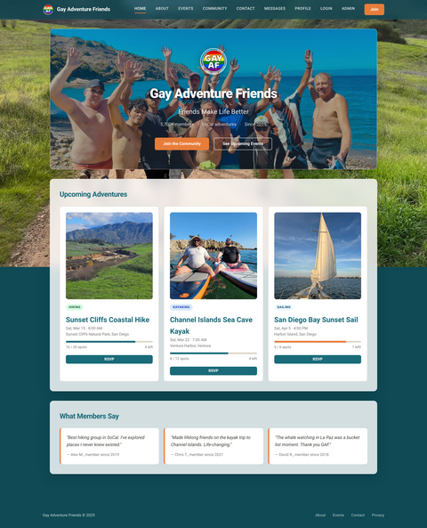</a> 
<b>Home</b> 
Hero section over adventure photography, upcoming events grid with capacity bars, member testimonials, community stats.
</td>
<td align="center" width="33%">
<a href="../screenshots/events.png">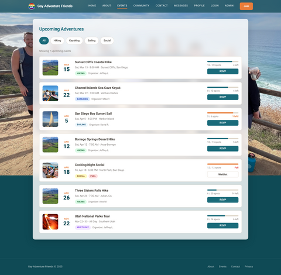</a> 
<b>Events</b> 
Chronological event list with category filter tabs, thumbnail photos, date blocks, capacity progress bars, RSVP buttons.
</td>
<td align="center" width="33%">
<a href="../screenshots/event-detail.png">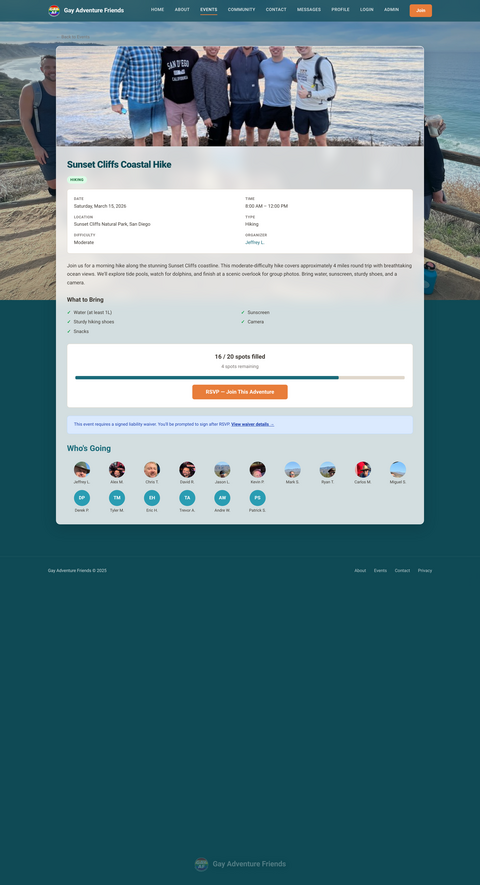</a> 
<b>Event Detail</b> 
Full event info with hero image, metadata grid, description, packing list, capacity section, waiver notice, attendee grid with profile photos.
</td>
</tr>
<tr>
<td align="center">
<a href="../screenshots/listings.png">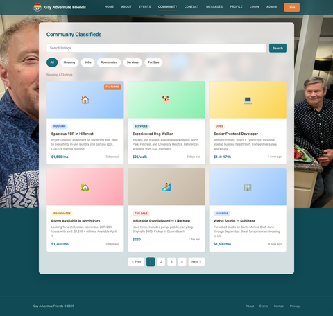</a> 
<b>Listings</b> 
Community classifieds with search bar, category pills, paginated card grid showing photos, prices, seller badges, and contact buttons.
</td>
<td align="center">
<a href="../screenshots/listing-detail.png">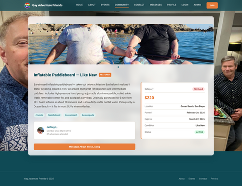</a> 
<b>Listing Detail</b> 
Full listing page with photo gallery, seller card with profile photo, price, description, condition badge, and message seller button.
</td>
<td align="center">
<a href="../screenshots/contact.png">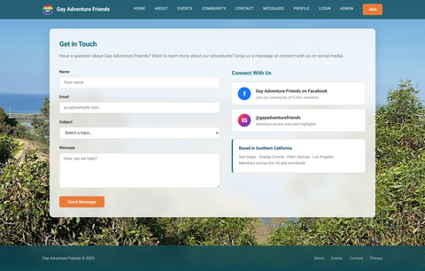</a> 
<b>Contact</b> 
Contact form with name, email, and message fields. Includes links to social media and community guidelines.
</td>
</tr>
</table>

---

## RSVP & Waivers

<table>
<tr>
<td align="center" width="50%">
<a href="../screenshots/rsvp.png">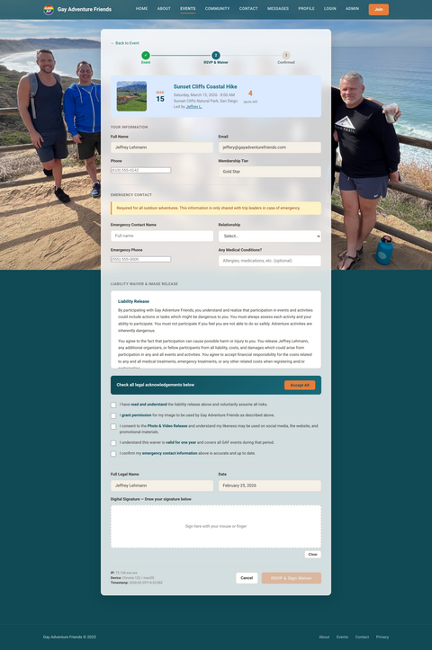</a> 
<b>RSVP + Waiver</b> 
Combined RSVP and liability waiver flow. Three-step progress indicator, event summary, emergency contact form, full waiver text with liability release, photo/video release (4 usage categories with opt-out), digital signature canvas with mouse/touch drawing, 5 legal checkboxes. Submit button stays disabled until all checkboxes are checked and signature is drawn.
</td>
<td align="center" width="50%">
<a href="../screenshots/waiver-sign.png">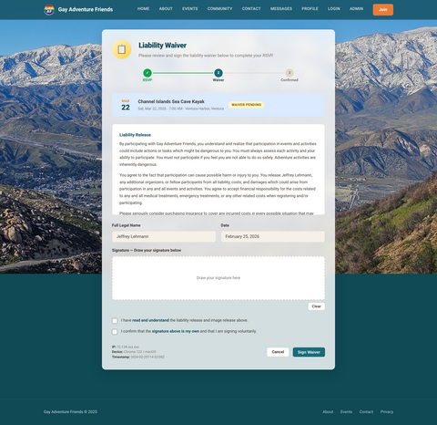</a> 
<b>Waiver Sign</b> 
Standalone waiver page accessible from event detail. Same full legal text, digital signature canvas, and acceptance checkboxes. Can be signed independently of RSVP.
</td>
</tr>
</table>

---

## Auth & Membership

<table>
<tr>
<td align="center" width="50%">
<a href="../screenshots/login.png">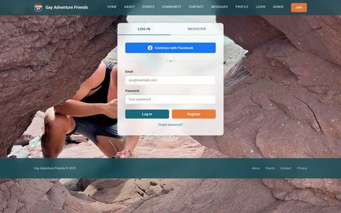</a> 
<b>Login</b> 
Email/password login with Facebook OAuth button, password reset link, and registration prompt. Frosted glass card centered over adventure photography.
</td>
<td align="center" width="50%">
<a href="../screenshots/join.png">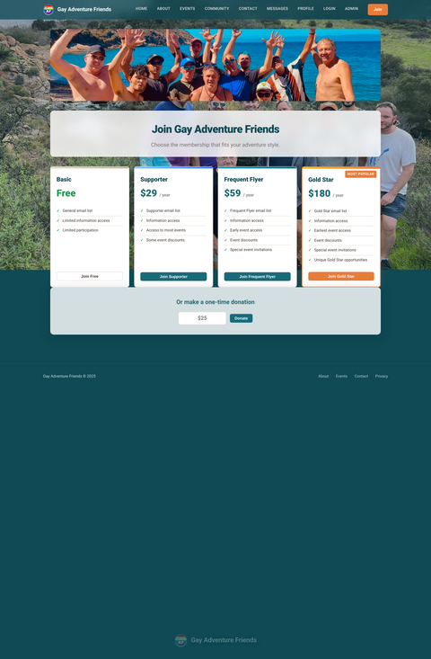</a> 
<b>Join / Membership</b> 
Four membership tiers (Basic $0, Supporter $29, Frequent Flyer $59, Gold Star $180) in a comparison table. Feature checklist per tier, Stripe payment integration, one-time donation option.
</td>
</tr>
</table>

---

## Messaging

<table>
<tr>
<td align="center" width="50%">
<a href="../screenshots/messages.png">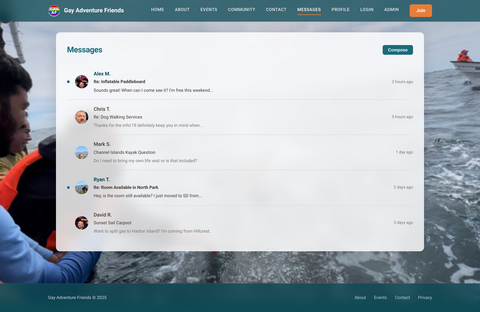</a> 
<b>Messages</b> 
Inbox with conversation list. Each row shows member photo, name, message preview, timestamp, and unread indicator badge.
</td>
<td align="center" width="50%">
<a href="../screenshots/conversation.png">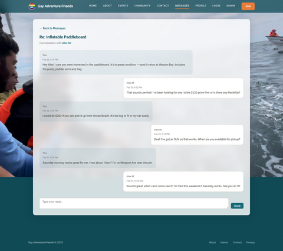</a> 
<b>Conversation</b> 
Message thread with alternating sent/received bubbles, timestamps, read receipts, and compose bar with send button.
</td>
</tr>
</table>

---

## Member Profiles

10 member profiles with real cropped face photos from GAF adventure trips, membership info cards, RSVP history, and activity feeds.

<table>
<tr>
<td align="center" width="33%">
<a href="../screenshots/member.png">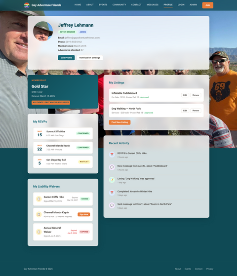</a> 
<b>My Profile</b> 
Logged-in member view with edit controls
</td>
<td align="center" width="33%">
<a href="../screenshots/profile-jeffrey.png">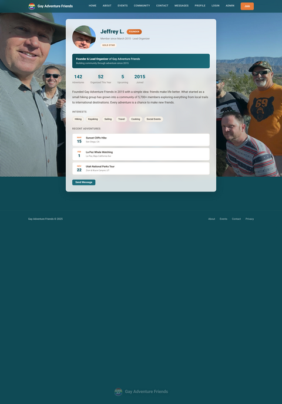</a> 
<b>Jeffrey L.</b> 
Founder &amp; organizer
</td>
<td align="center" width="33%">
<a href="../screenshots/profile-alex.png">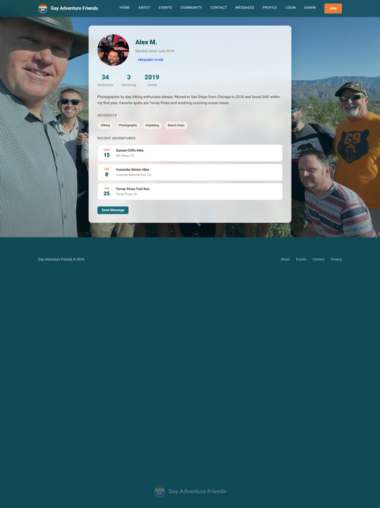</a> 
<b>Alex M.</b> 
Member since 2019
</td>
</tr>
<tr>
<td align="center">
<a href="../screenshots/profile-chris.png">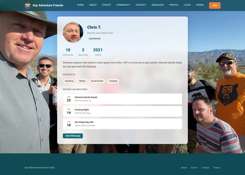</a> 
<b>Chris T.</b>
</td>
<td align="center">
<a href="../screenshots/profile-david.png">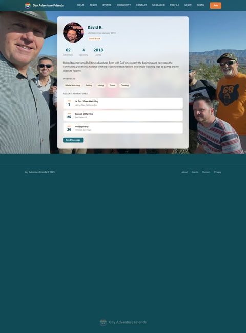</a> 
<b>David R.</b>
</td>
<td align="center">
<a href="../screenshots/profile-jason.png">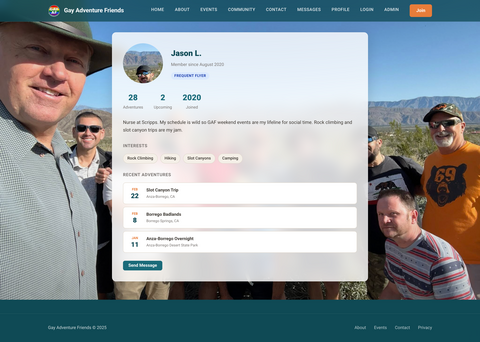</a> 
<b>Jason L.</b>
</td>
</tr>
<tr>
<td align="center">
<a href="../screenshots/profile-kevin.png">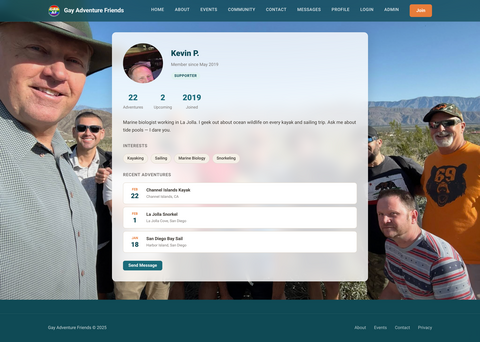</a> 
<b>Kevin P.</b>
</td>
<td align="center">
<a href="../screenshots/profile-mark.png">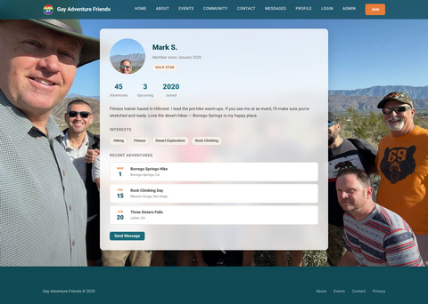</a> 
<b>Mark S.</b>
</td>
<td align="center">
<a href="../screenshots/profile-miguel.png">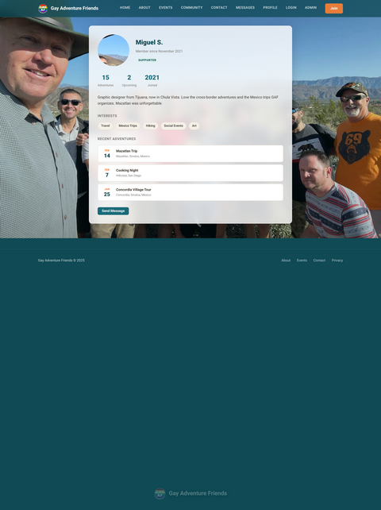</a> 
<b>Miguel S.</b>
</td>
</tr>
<tr>
<td align="center">
<a href="../screenshots/profile-carlos.png">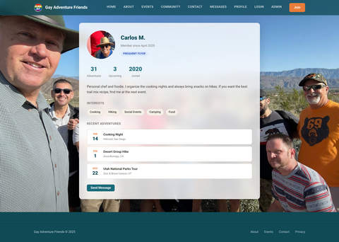</a> 
<b>Carlos M.</b>
</td>
<td align="center">
<a href="../screenshots/profile-ryan.png">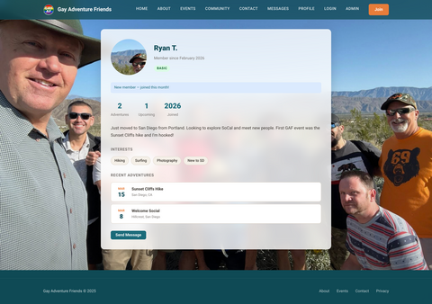</a> 
<b>Ryan T.</b>
</td>
<td></td>
</tr>
</table>

---

## Admin Panel

7-page admin dashboard with sidebar navigation, revenue metrics, and management tools.

<table>
<tr>
<td align="center" width="33%">
<a href="../screenshots/admin.png">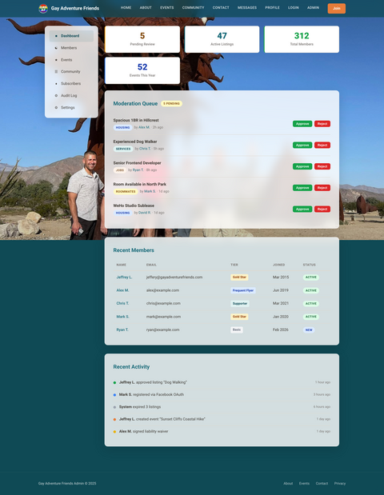</a> 
<b>Dashboard</b> 
Overview with moderation queue, member stats, recent activity, pending approvals.
</td>
<td align="center" width="33%">
<a href="../screenshots/admin-members.png">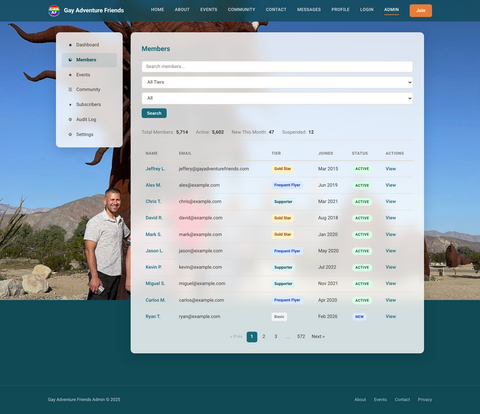</a> 
<b>Members</b> 
Member table with search, role badges, status filters, edit/suspend actions.
</td>
<td align="center" width="33%">
<a href="../screenshots/admin-events.png">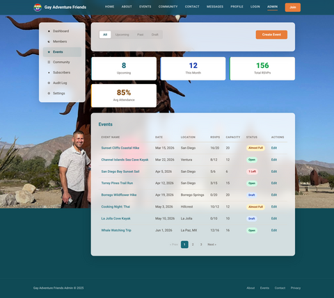</a> 
<b>Events</b> 
Event management with capacity tracking, approval workflow, cancellation controls.
</td>
</tr>
<tr>
<td align="center">
<a href="../screenshots/admin-subscribers.png">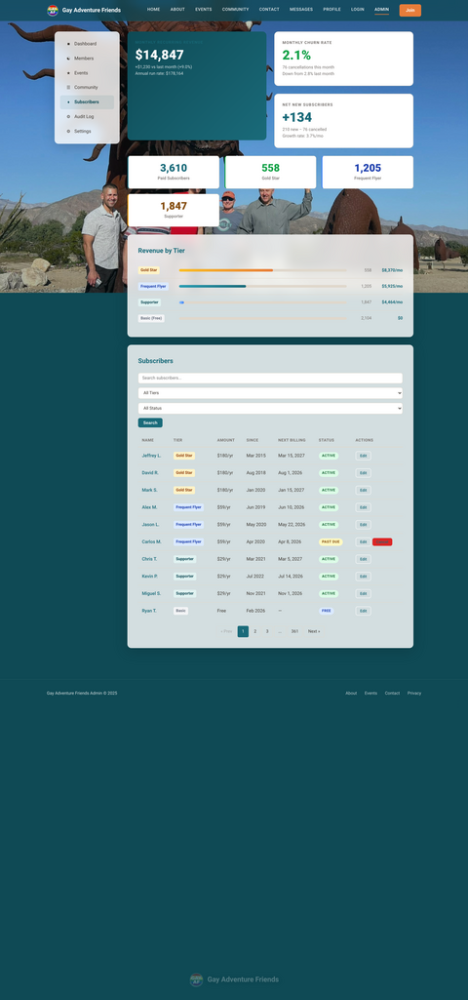</a> 
<b>Subscribers</b> 
Revenue dashboard — MRR $14,847, churn 2.1%, revenue-by-tier breakdown bars, subscriber table with edit/cancel.
</td>
<td align="center">
<a href="../screenshots/admin-community.png">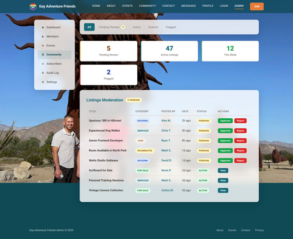</a> 
<b>Community</b> 
Listing moderation, flagged content queue, category management.
</td>
<td align="center">
<a href="../screenshots/admin-audit.png">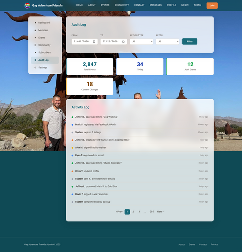</a> 
<b>Audit Log</b> 
Immutable event log with actor, action, target, timestamp, and detail expansion.
</td>
</tr>
<tr>
<td align="center">
<a href="../screenshots/admin-settings.png">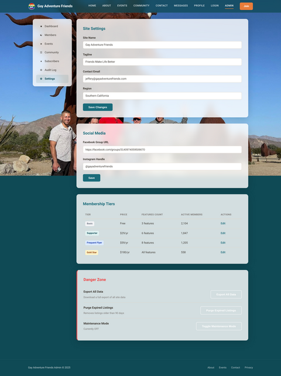</a> 
<b>Settings</b> 
Platform configuration — site name, contact email, Stripe keys, Facebook OAuth, feature toggles.
</td>
<td></td>
<td></td>
</tr>
</table>

---

## Design System

All 30 pages share a unified design system:

- **Frosted glass over photography** — `backdrop-filter: blur(20px)` content cards over fixed background
- **20-photo crossfade slideshow** — 7-second per-slide cycle with per-page starting images
- **Shared CSS** — `gaf-theme.css` with design tokens (colors, spacing, typography, component styles)
- **Responsive** — mobile breakpoints at 640px across all pages
- **Interactive elements** — digital signature canvas, reactive form validation, capacity bars, scroll-driven nav/footer transitions
- **Photographer credit** — scrolling reveals credit overlay with adventure name and photographer link
